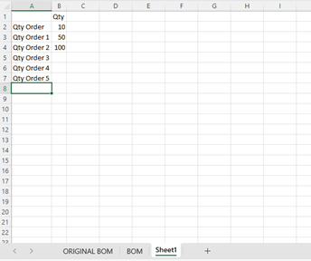

# Concisys BOM Quoter

This project, "Concisys BOM Quoter," is built upon the foundations of Digi-Key, Mouse, and TTI APIs.

## Description

The "Concisys BOM Quoter" is a tool designed to generate accurate pricing for customer Bill of Materials (BOM) in electronic manufacturing projects. By utilizing the functionalities provided, this tool simplifies the process of estimating costs and generating quotes for electronic components, as well as give Project Managers (PMs) an efficient way to determine the best pricing for individuals parts across various vendors within the SMT parts industry. PMs no longer have to spend countless hours scouring the internet for part availability. 

# Getting Started

## System Requirements

**Required**
1. Python 3.10 or higher
2. [Anaconda](https://docs.anaconda.com/free/anaconda/install/index.html) or PIP (comes with Python installation) installed
3. (Optional) Latest stable chromedriver.exe -> [Download](https://chromedriver.chromium.org/downloads)
    - Latest Stable: v113, v114

## Installation

<!-- **Developer Set up** -->
1. Ensure that you have the latest Python installed on your local machine
2. Clone the bom_quoter Github repository or download the project ZIP file into your local machine
3. Install the required dependencies into a virtual environment. You can find the configuration files under the `config` directory.
    - If using Anaconda: `conda env create -n my-env-name -f environment.yml` or `conda env create -n my-env-name -f /path/to/environment.yml`
    - If using PIP: 
        - Create your virtual environment: `python -m venv my-env-name`
        - Activate your virtual env: `my-env-name\Scripts\activate.bat` (Windows), `source .venv/bin/activate` (OS)
        - Then install dependences: `pip install -r requirements.txt` or `pip install -r path/to/requirements.txt`
4. Open the bom_quoter directory in your virtual environment (cmd.exe on Windows or Terminal on Mac)
5. Enter the command `pip setup.py install` to setup packages. Otherwise, the BOM Quoter will not work.
6. To activate the program, `cd` to main directory and enter: `python bomquoter.py` in the command line.

<!-- **User Set up**
1. Obtain the `concisys-bom-quoter.exe` executable file.
2. Double-click on the file to open the program
3. Follow the instructions in the User Guide below to setup your BOM file for upload.
4. Copy the file path to upload the file. -->

# User Guide

## Setting up the BOM

**Required**: 
- Customer BOM file: BOM file from the customer or your own BOM file to upload
- BOM_input_template: found in the `templates` folder; the required 'BOM' and 'Sheet1' sheets needs to be copied from this file and placed in your BOM file

1. In the project directory, open or obtain the `BOM_input_template.xlsx` file from the templates directory.
2. Open the BOM input template. There are two sheets that are required for the BOM Quoter processing to be successful: 'BOM' and 'Sheet1'. Note: do NOT delete or change the name of these sheets in your BOM file upload as it will create syntax errors.
3. Instead, to avoid errors, create a new copy of the 'BOM' sheet and 'Sheet1' sheet in your BOM file and copy/paste the columns from the respective sheet in the BOM template to your BOM file.
 
    
 
4. All the cells in the following columns of the 'BOM' sheet are required to be filled:
 
    - ***Item***: line item number
    - ***Reference Designators***: found in original BOM, location of the part on PCB when assemble
    - ***Description*** : description of part
    - ***Manufacturer Part Number***: manufacturing part number
    - ***Quantity***: quantity of part for a single board
        - If item is DNI/Do Not Install put in 0 if you need to keep it in the BOM
    - ***Qty Need***: the quantity needed to complete quantity order (more than 1 board)
    - ***Qty Buy***: the quantity to buy to complete quantity order
    
5. Go to 'Sheet1' that you copied into your BOM file, enter the _Qty Order_ value to the _Qty_ column.
 
    
 
6. If there is more than one value in the column, add the Q# Need and Q# Buy to ‘BOM’ where # is _Qty Order_ number. See figures 5 and 6.
    
     

7. Save your BOM file with the changes from Steps 1-6. Copy the file path; you will paste this into the BOM Quoter when prompted.
 
 You are now ready to upload the BOM file to the BOM Quoter.
 
## Uploading the BOM
1. Run the _concisys-bom-quoter_ program
2. After running the program, you will be prompted to enter the BOM file path. Paste the file path you copied previously and press enter to continue
 
```
Enter the path to the file: C:/path/to/BOM.xlsx
```
 
3. For web scraping results follow the prompt:
 
```
-----------------------------------------------------------------------
Would you like to continue with web scraping? y|n: y

You answered YES. Please note that this feature is still in beta and may not be available in this version.
Choosing this option can extend the process up to 30 minutes or more due to the additional time required. Use caution when using the BOM Quoter with web scraping.

To continue to receive scraped results enter 'y'. For quicker processing enter 'n'.
-----------------------------------------------------------------------
Would you like to continue with web scraping? y|n: y
```

4. Next the Qty Order prompt will run as follows:
 
```
Enter the qty order 'Buy' value you would like to compare.
For example, if you would like to compare Q1 qty orders, then eneter 'Q1 Buy'; if comparing Q2 qty orders, then enter 'Q2 Buy'; and so on and so forth.

If you do not have a Qty Order to compare, then please eneter 'Qty Buy' for the best results
-----------------------------------------------------------------------
Please enter your choosen column(s): Q2 Buy

```
 
5. Program is processing the file:
 
```

Quoting the BOM. Please wait..

```
    
6. If DigiKey access token is expired, the program will refresh and replace the token:
     
```

Bearer token  expired

DigiKeyTokenError: [Error Message]

Refreshing Token. Please wait..
Refresh access token: ****************

```

7. BOM Quoter Success
 
    Without web scraping: 
    
```

Digikey Done: 1/3 completed
TTI Done: 2/3 completed
Mouser Done: 3/3 completed

BOM Quotation completed! Results were stylized and saved in the original file.
---- Total Timelapse in 123.45678899078979 seconds ----

```
    
    With web scraping:
    
```

Digikey Done: 1/3 completed
TTI Done: 2/3 completed
Mouser Done: 3/3 completed
Running web scraper..

BOM Quotation completed! Results were stylized and saved in the original file.
---- Total Timelapse in 123.45678899078979 seconds ----

```

# License

This project is licensed under the [MIT License](docs/LICENSE.md)

# Acknowledgements

This project is built upon the Digikey, Mouser, and TTI APIs, as well as the current Concisys ERP, which served as a foundation for the "Concisys BOM Quoter."

# Contributing
Main Contributors:
Lan Do
Monica Nguyen

Copyright 2023-2024 Concisys Inc. all rights reserved

