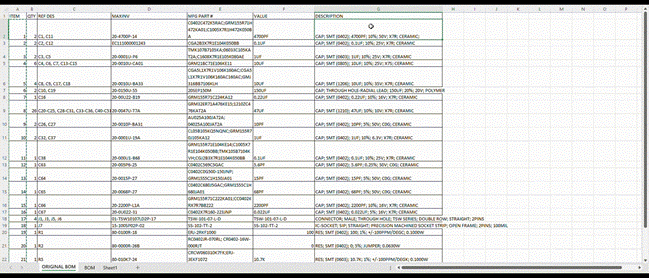
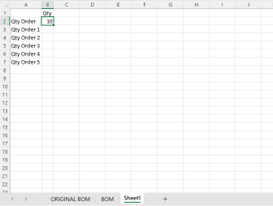
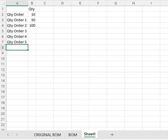
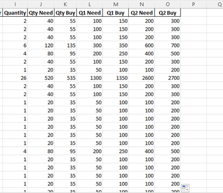

# Overview

The Concisys BOM Quoter is a Python-based CLI program that is designed based off of the current Concisys ERP Material Inquiry feature, in which users (e.g., program managers) upload a _Bill of Materials (BOM)_ excel file to quote part items based on available vendors. It enables users to upload a BOM from their computer via the command line and returns the file with available part items and their attributes to determine accurate labor price quotes.

While the BOM Quoter has many similar functions as the ERP feature, this program also allows the user to compare pricing results based on the quantity order. For example, if a original quantity order is currently being quoted for 100 boards but a customer would also like to know the quote for a later time with 1000 boards of the same type of order, the quantity price will be determined and compared in the BOM Quoter.

# How it works

## Project Overview

[BOM Quoter Repository](https://github.com/concisys-dev0/bom_quoter)

The project folder hierarchy is as follows:

- `assets`: contains Excel files for BOM file configurations
	- `sample`: sample BOM files to show end results
	- `templates`: empty BOM template
- `config`: contains all the configuration files needed to start the program
- `docs`: BOM Quoter documentation and licensing
- `temp`: contains corresponding JSON files to temporary store API credentials and results
- `utils`: library containing API and scraping operations
- `main.py`: Main CLI program
- `setup.py`: setup script to initiate `utils` library

## Python Libraries

The Python language was preferred over other languages for building the BOM Quoter due to its versatility, simplicity, and widespread adoption. With its extensive ecosystem of libraries and frameworks, it provides a solid foundation for connecting to various APIs while handling complex data operations in addition to its support of data flow and compatibility with data formats, such as JSON, XML and CSV.

The code was written in functional program approach to handle data flow. It utilizes various Python libraries and modules. The main libraries used within this program include, but are not limited to:

 - Excel file handing: _pandas_, _numpy_, _openpyxl_, _json_
 - API Requests: _requests_, _requests-oauthlib_, _webbrowser_
 - Web Scraping: _selenium_, _webdriver-manager_, _beautifulsoup4_
 - Other libraries include: _time_, _sys_, _os_, _pathlib_, _operator_, _schedule_, _math_, _setuptools_

## Vendor APIs

The BOM Quoter allows the user to briefly connect to three RESTful APIs from DigiKey, Mouser Electronics, and TTI and returns data in JSON format.


### DigiKey API

| Scripts               | Description                                                               |
|-----------------------|---------------------------------------------------------------------------|
|  dk_keyword_buy_info  |  Get information from DigiKey API search                                  |
|  dk_oauth2_login      |  DigiKey login automation to change user credentials                      |
|  dk_oauth2_token      |  DigiKey API authentication                                               |
|  dk_RFQ_BOM           |  Parse DigiKey results and save into an excel sheet called ‘DK_Results’   |
|  dk_search_info       |  API operations for DigiKey part search                                   |


**Authorization URL**: [Version 1](https://api.digikey.com/v1/oauth2/authorize)

**Token URL**:  [Version 1](https://api.digikey.com/v1/oauth2/token)

**Authentication**: The API requires OAuth2 authentication to acquire the DigiKey API access token. To get client credentials for access, create a developer account on DigiKey developer website and follow the instructions to open an organization and receive a Client ID and Client Secret.

**Rate Limits**: DigiKey API is limited to 1000 requests per day per account. Additionally, after every 120 requests, API requires a 60 second cool-down time. Initiated tokens are refreshed every 30 minutes. This program provides up to 2000-3000 requests by default.


### Mouser API

| Scripts                 | Description                                                               |
|-------------------------|---------------------------------------------------------------------------|
|  mouser_apiKeys         |  Handles user information and change user’s API key as needed             |
|  mouser_RFQ_BOM         |  Parse Mouser results and save into an excel sheet called ‘Mouser_Results’|
|  mouser_search_buy_info |  Get information from Mouser product search                               |
|  mouser_search_v1       |  API operations for Mouser API v1                                         |
|  mouser_search_v2       |  API operations for Mouser API v2                                         |

**Authorization URL**: [Mouser API Version 1](https://api.mouser.com/api/v1/search), [Mouser API Version 2](https://api.mouser.com/api/v2/search/)

**Authentication**: The API requires authentication via the Mouser API key. Sign up for a developer account at Mouser developer website and follow the instructions to receive a Search API key.

**Rate Limits**: Mouser API is limited to 1000 requests per day per account. Additionally, after every 30 requests, API requires a 60 second cool-down time. This program provides up to 2000 requests by default.


### TTI API

| Scripts                 | Description                                                               |
|-------------------------|---------------------------------------------------------------------------|
|  tti_RFQ_BOM            |  Parse TTI results and save into an excel sheet called ‘TTI_Results’      |
|  tti_search_buy_info    |  Get information from TTI API response                                    |
|  tti_search             |  API operations for TTI product search                                    |

**Authorization URL**: [TTI API Version 1](https://api.tti.com/service/api/v1/search/)

**Authentication**: The API requires authentication via the TTI API key. Please refer to your Concisys supervisor to get this API key.

**Rate Limits**: TTI API is limited to 1000 requests per day per account. Additionally, after every 100 requests, API requires a 60 second cool-down time. This program does not currently have request limitations due to Concisys company account credentials.


## Main Functionality

The back-end functionality and API operations in this project are packaged under the `utils` package. The listed scripts below correspond to the following categories in the `utils` package.

|  Functions                                          | Parameters           | Description                                                                          |
|-----------------------------------------------------|----------------------|--------------------------------------------------------------------------------------|
| `utils.input_BOM.setup_BOM_info`                    | `path`: path to file | Gather the information required for each vendor API and pass the BOM to a dataframe  |
| `utils.mergeCompare_pricing.compare_options_result` | `path`: path to file | Asking the user for which price of quantity to compare between suppliers.   |
| `utils.mergeCompare_pricing.get_compare_results`    | `path`: path to file, `compare_column`: [str] name of column to compare | Returns the lowest price from API results and inserts it into a new dataframe. |
| `utils.fixed_BOM.df_result_without_scraping`        | `path`: path to file | Gets part data from the function above and returns a dataframe of terminals based on industry standards and package codes.|
| `utils.fixed_BOM.scrape_saved`                      | `path`: path to file | Gets part data from the function above and returns a dataframe of terminals based on industry standards and package codes with web scraping.  |
| `utils.fixed_BOM.save_RQF_BOM`                      | `path`: path to file, `df_r2`: dataframe of total results output | Inserts the dataframe results into the file and stylizes the excel sheet for 'Best_Prices' sheet.  |
| `utils.summary.save_summary`                        | `path`: path to file | Returns the count for line items and part attributes (TH, SMT, etc.) and inserts the results in a new sheet called 'Summary.' |

# Installation

## System Requirements

**Required**
1. Python 3.10 or higher
2. [Anaconda](https://docs.anaconda.com/free/anaconda/install/index.html) or pip installed
3. (Optional) Latest stable chromedriver.exe -> [Download](https://chromedriver.chromium.org/downloads)
    - Latest Stable: v113, v114

## Setup

**Developer Set up**
1. Ensure that you have the latest Python installed on your local machine
2. Clone the bom_quoter Github repository or download the ZIP file into your local machine
3. Install the required dependencies into a virtual environment. You can find the configuration files under the `config` directory.
    - If using Anaconda: `conda env create -n my-env-name -f environment.yml` or `conda env create -n my-env-name -f /path/to/environment.yml`
    - If using PIP: 
        - Create your virtual environment: `python -m venv my-env-name`
        - Activate your virtual env: `my-env-name\Scripts\activate.bat` (Windows), `source .venv/bin/activate` (OS)
        - Then install dependences: `pip install -r requirements.txt` or `pip install -r path/to/requirements.txt`
4. Open the bom_quoter directory in your virtual environment (cmd.exe on Windows or Terminal on Mac)
5. Enter the command `pip setup.py install` to setup packages. Otherwise, the BOM Quoter will not work.
6. To activate the program, `cd` to main directory and enter: `python bomquoter.py` in the command line.

**User Set up**
1. Obtain the `concisys-bom-quoter.exe` executable file.
2. Double-click on the file to open the program
3. Follow the instructions in the User Guide below to setup your BOM file for upload.
4. Copy the file path to upload the file.

# User Guide

## Setting up the BOM

**Required**: 
- Customer BOM file: BOM file from the customer or your own BOM file to upload
- BOM_input_template: found in the `templates` folder; the required 'BOM' and 'Sheet1' sheets needs to be copied from this file and placed in your BOM file

1. In the project directory, open or obtain the `BOM_input_template.xlsx` file from the templates directory.
2. Open the BOM input template. There are two sheets that are required for the BOM Quoter processing to be successful: 'BOM' and 'Sheet1'. Note: do NOT delete or change the name of these sheets in your BOM file upload as it will create syntax errors.
3. Instead, to avoid errors, create a new copy of the 'BOM' sheet and 'Sheet1' sheet in your BOM file and copy/paste the columns from the respective sheet in the BOM template to your BOM file.
 
<<<<<<< HEAD
    
=======
    
>>>>>>> 31c12257b6641f70133d2ff8b9e57e1031abc06c
 
4. All the cells in the following columns of the 'BOM' sheet are required to be filled:
 
    - ***Item***: line item number
    - ***Reference Designators***: found in original BOM, location of the part on PCB when assemble
    - ***Description*** : description of part
    - ***Manufacturer Part Number***: manufacturing part number
    - ***Quantity***: quantity of part for a single board
        - If item is DNI/Do Not Install put in 0 if you need to keep it in the BOM
    - ***Qty Need***: the quantity needed to complete quantity order (more than 1 board)
    - ***Qty Buy***: the quantity to buy to complete quantity order
    
5. Go to 'Sheet1' that you copied into your BOM file, enter the _Qty Order_ value to the _Qty_ column.
 
<<<<<<< HEAD
    
 
6. If there is more than one value in the column, add the Q# Need and Q# Buy to ‘BOM’ where # is _Qty Order_ number. See figures 5 and 6.
    
     
=======
    
 
6. If there is more than one value in the column, add the Q# Need and Q# Buy to ‘BOM’ where # is _Qty Order_ number. See figures 5 and 6.
    
     
>>>>>>> 31c12257b6641f70133d2ff8b9e57e1031abc06c

7. Save your BOM file with the changes from Steps 1-6. Copy the file path; you will paste this into the BOM Quoter when prompted.
 
 You are now ready to upload the BOM file to the BOM Quoter.
 
## Uploading the BOM
1. Run the _concisys-bom-quoter_ program
2. After running the program, you will be prompted to enter the BOM file path. Paste the file path you copied previously and press enter to continue
 
```
Enter the path to the file: C:/path/to/BOM.xlsx
```
 
3. For web scraping results follow the prompt:
 
```
-----------------------------------------------------------------------
Would you like to continue with web scraping? y|n: y

You answered YES. Please note that this feature is still in beta and may not be available in this version.
Choosing this option can extend the process up to 30 minutes or more due to the additional time required. Use caution when using the BOM Quoter with web scraping.

To continue to receive scraped results enter 'y'. For quicker processing enter 'n'.
-----------------------------------------------------------------------
Would you like to continue with web scraping? y|n: y
```

4. Next the Qty Order prompt will run as follows:
 
```
Enter the qty order 'Buy' value you would like to compare.
For example, if you would like to compare Q1 qty orders, then eneter 'Q1 Buy'; if comparing Q2 qty orders, then enter 'Q2 Buy'; and so on and so forth.

If you do not have a Qty Order to compare, then please eneter 'Qty Buy' for the best results
-----------------------------------------------------------------------
Please enter your choosen column(s): Q2 Buy

```
 
5. Program is processing the file:
 
```

Quoting the BOM. Please wait..

```
    
6. If DigiKey access token is expired, the program will refresh and replace the token:
     
```

Bearer token  expired

DigiKeyTokenError: [Error Message]

Refreshing Token. Please wait..
Refresh access token: ****************

```

7. BOM Quoter Success
 
    Without web scraping: 
    
```

Digikey Done: 1/3 completed
TTI Done: 2/3 completed
Mouser Done: 3/3 completed

BOM Quotation completed! Results were stylized and saved in the original file.
---- Total Timelapse in 123.45678899078979 seconds ----

```
    
    With web scraping:
    
```

Digikey Done: 1/3 completed
TTI Done: 2/3 completed
Mouser Done: 3/3 completed
Running web scraper..

BOM Quotation completed! Results were stylized and saved in the original file.
---- Total Timelapse in 123.45678899078979 seconds ----

```

# Issues

|Date   |Issue Description   |Temporary Fix (if applicable)   |
|---|---|---|
|8/2/23  |Daily Rate Limit Per Minute Exceed error with code 403 from Mouser when two or more users are using the program   |   |
|8/2/23 |Latest Chrome version 115 is not stable.    |Using chrome version < 114 to test the program.   |
|8/2/23   |Inconsistent errors with ElementNotInteractableException: Message: element not interactable   |The error can be reduced by adding more wait time when doing web scraping.   |
|8/2/23   |ConnectionError: ('Connection aborted.', ConnectionResetError(10054, 'An existing connection was forcibly closed by the remote host', None, 10054, None))   |   |
|8/2/23   |ConnectionError: HTTPSConnectionPool(host = 'api.github.com', port=443): Max retries exceeded   |Added ‘verify=False’ in the parameter of request operation to reduce the HTTPSConnectionPool related errors
|8/2/23   |ReadTimeout: HTTPSConnectionPool(host='api.mouser.com', port=443): Read timed out. (read timeout=None) |Added number of seconds to timeout parameter in API request, but breaks the TTI API operation and makes it more prone to connection errors   |

# Future developments and improvements

The BOM Quoter team has identified several potential areas for future feature development and improvements. These include:

- Optimize fixed_BOM code using data structure to manage mounting type, package/case and terminals data flows to improve its latency 
- More testing to identify, resolve bugs and errors for better throughput
- Improve the GUI to use as desktop or web app
- Optimize the use of scheduling and parallel programing to decrease the wait time of web scraping
- Setup internal database to save data collected from suppliers API, for faster access and compare when need to find substitute part or check on our own stocks
- Automate total materials and labor cost calculation
- Current file reference structure prevents valid executable from being released. However, program is able to run via backend.

# Conclusion

The Concisys BOM Quoter prototype, which is currently undergoing rigorous testing, represents a significant milestone in our journey to create a reliable, robust, and lightweight backup solution to our existing ERP web application. Throughout development, we have strived to address the critical need for a dependable contingency plan in order to ensure the continuity of our core operations
Our next step is to have rigorous testing on the user-end to identify real-world user pain points when using either this program or the ERP. Moving forward, the insights gained from the prototyping phase will play a pivotal role in further refining and optimizing the backup solution to the Concisys ERP. The feedback and observations gathered from testers and end-users will enable us to tailor the prototype to meet the specific requirements of our organization.

The development of this backup solution aligns with our commitment to delivering a seamless and reliable experience to our users. With this innovative system in place, we can confidently mitigate potential risks and bolster our software application's resilience against any unexpected disruptions.

In the coming phases, we will focus on addressing the valuable insights gathered during testing, continuing to enhance the user experience, and ensuring that the backup system seamlessly integrates with our primary software application. Together, these efforts will culminate in a complete and comprehensive backup solution that reinforces the stability and continuity of our critical operations.
